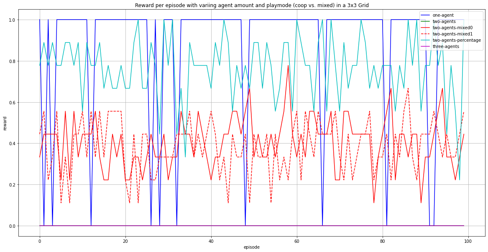
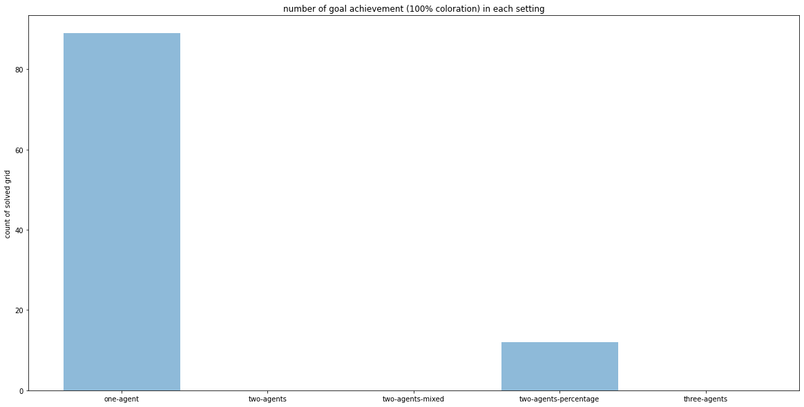
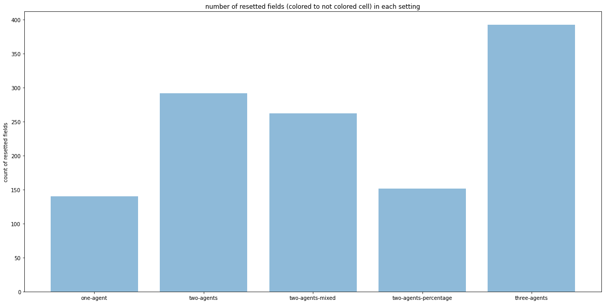

FRAGEN:
1) dqn hyperparameter tuning - was kann man verbessern/verändern
2) meinung zu plots
3) kurzes feedback zu ausarbeitung

TODO:
- DQN implementation
- Basic Difference reward (each step reward compared with waiting action) 
- plots refinement: plot matrix where each row is a setting with 4 columns 1) reward 2) grid coloration 3) trades 4) reset fields

--------------------------------------------------
- AM: statt aktion vllt state? 
-> oder micromanagement -> aktion wird anderem agenten vorgeschlagen
-> übergeordnet -> trade conditionieren auf actionssequenzen/verhaltensmuster
-> state als goal -> wenn state erreicht wurde verkauf/share 

- wiviele aktionen pro zeitschritt
- PLOT: trading matrix 
- PLOT: training für größeren bereich (grid size)
- Episoden längen / max steps ändern (mixed - vs not mixed)
one/two agents training visualisieren und speichern 

# shares
wann macht es sinn? -> würde es cap lösen/agenten helfen?
- Problem: agenten profitieren nicht von share verkauf! 
- Möglichkeit wäre es zu einem "realistischeren" Aktienmarkt zu machen: Agenten die kaufen zahlen einen fixpreis von zB 0.01 für 5% des Rewards
Agenten die verkaufen kriegen direkt den Gewinn -> das könnte es für agenten attraktiver machen zu verkaufen und durch shares ist es eh gut zu kaufen
- aktuelle Situation: 
    - trade findet statt, dann geht ein agent ins "minus" und der andere erhält den preis als reward
    - (ist es der letzte schritt wird der gewinn vom verkaufendem agenten auf alle käufer wieder aufgeteilt)
- wie löst es cap? momentan, dem plot zu urteilen macht das noch keinen unterschied

-> agent mit höherem reward = mehr shares = vermutung -> niedriger/kein störrfaktor

## Fragen
### shares
- soll der gezahlte betrag bis zum ende in jedem schritt als reward wieder an den agenten gegeben werden? Aktuell kauft agent einen share und geht dabei ins minus um 1/3 des anteils, also hier zB -0.016 und das aber auch nur einmalig (da kauf). nach abschluss des schrittes ist der reward wieder auf 0 und am ende der episode werden shares mit dem endgültigen reward verrechnet (bei 0 oder niedriger erhälten käufer nichts) 
- soll die letzte trading runde auch mitgezählt werden? ZB agent 2 kauft 5% shares von agent 1 und zahlt dafür 0.016 -> da letzte runde wird der gewinn von agent 1 (die 0.016) auf alle share besitzer mit aufgeteilt und agent 2 hat einen reward von -0.016 + (0.016*0.05) = -0.0152

--------------------------------- 
TODO unklarheiten
- start implementation of shareholder market
    - TBD:
        - "agents can only make either selling or buying offers at a time"? Not implemented yet, all agents can sell and buy 
          sm: Agent 1: [1,2,1] - Agent 2: [2,1,1] Agent 1 would sell a share to 2 but 2 would sell a share back (implemented in market/action_match)
          am: Agent 1: [1,2,2] - Agent 2: [2,1,1] Agent 1 buys action 2 from 2 but 2 also buys action 1 from 1
          Is Buying or Selling regarded first?
        - Currently every step includes action markets -> should there be a default to not buy market actions? Or should there be a bool to specify
          if the agent wants to sell or buy (or do nothing)?
        - How to define the action space? Problem is the current Linear NN which returns a number within the action_space
            is an encoding sufficient? sm: action_space.n=5 NN returns a number of 5x5 i.e. 25 = [4,4] -> hotencoding
----------------------------
- ANMERKUNG: two agents mixed resetted fields: agenten setzen gegnerische felder nicht gezielt zurück, da sie dadurch selbst keine direkten vorteil erzielen (feld ist dann nur resetted aber nicht ihnen zugehörig) (vermutlich würden sie eher diese taktik spielen, wenn die felder nicht zurückgesetzt werden, sondern direkt ihre farbe übernehmen)
    - vielleicht noch neue settings: 
        - competitive mixed, bei denen nur der agent mit höherem prozent den reward erhält?
        - mixed without reset, bei denen felder direkt die farbe des agenten übernehmen ohne zurück gesetzt zu werden (kein bit switching mehr)
- plot feedback:
    - for all settings show coloration percentage - done
    - one plot with overall percentage of mixed AND percentage setting of two agents
    - plot during training w csv maybe (i.e. take last n episodes)
        - two criteria 1) how fast converge (zB bei der wievielten episode hat ein agent es gelernt?) and 2) how stable is it? (zB bei einem agent -> macht er trotzdem noch oft fehler?) 
        - take training logged csv, convert to pandas and plot in jupyter
- market adaptation:
    - encoding of actions
    - market matrix: agent can EITHER buy or sell in one step!
        - sm: 
            - (env_aktion, "verkaufen", "share/aktion")
            - (env_aktion, "kaufen", "share/aktion von anderen")
            - (env_aktion, "nichts tun", "[keine bedeutung hier] share/aktion")
            - wenn verkaufen der fall ist und mehrere agenten kaufen möchten kriegt jeder eine aktie -> beim ende einer episode und der reward berechnung erhalten die aktionäre dann die dividenden in einer gewissen betragshöhe (kaufpreis hier gleich dividende zB 0.5)
            - Fällt balance des agents beim trade unter null findet der trade nicht statt. möchten mehrere agents kaufen wird in ZUFÄLLIGER REIHENFOLGE verkauft
        - am: 
            - (aktion_zu_verkaufen, "verkaufen", agent)
            - (aktion_zu_kaufen, "kaufen", agent) -> führt man hier auch gleichzeitig eine env aktion aus?
            - (env_aktion, "nichts tun", agent)  
            - ????? zu fragen:
            aktion sieht vermutlich so aus:
            - (aktion_zu_verkaufen, verkaufen, agent)
                - wenn nichtstun gewählt wurde führt man die aktion in der umgebung aus?
                - wenn kaufen gewählt wurde kauft man vom gewähltem agent die aktion, aber was macht man wenn der gewählte agent nicht die aktion ausführt? In der Umgebung wird bei einem kauf nichts ausgeführt, ansonsten schon?
                - wenn verkaufen gewählt wurde aber niemand kauft macht man nichts? Wenn gekauft wird, führt man die aktion aus?
            - vermutung -> [aktion, agent/nichtstun, kaufaktion] beim Actionmarkt kauft man aktionen 
            
-------------
- implement another learning algorithm? I.e. (single) DQN?

done:
- plot that show the CAP
    - mean reward/episode for a one agent environment training vs multi agent environments (i.e. 2 and 3 agents)
    - amount of reset fields per episode in a one agent environment training vs multi agent environments (i.e. 2 and 3 agents)
# Installation
First clone this repository and navigate into the domain Folder
```
git clone https://github.com/zarahz/CMARL-CAP-and-Markets.git
cd CMARL-CAP-and-Markets/Coloring
pip install -e .
```

# Execution
Now you can run the domain with the following algorithms

### Q Learning 
For a very basic Q Learning algorithm you can execute
```
> python .\Coloring\scripts\q_learning.py --env "Empty-Grid-v0" --agents 2 --agent_view_size 5 --max_steps 10 --episodes 5 --size 5
```
required arguments are `--env` and `--agents`

### PPO (Fine tuning of parameters is still in process, so learning is not optimal)
To train the model first execute the corresponding script:
```
> python -m Coloring.scripts.train --algo ppo --model "EmptyGrid" --save-interval 10 --frames 80000
```
required argument is `--algo`.

Visualization of the environment based on the trained model can be achieved with:
```
> python -m Coloring.scripts.train --model "EmptyGrid"
```
required argument is `--model`.


# Current Observations
For a run of 100 Episodes with max steps of 25 each, here are the current observations: 


Number of times the environment was solved, counted with reward=1 feedback.


Number of times cells were reset.


# Untersuchung der Auswirkungen von Märkten auf das Belohnungs-Zuweisungsproblem in kooperativen Multiagenten-Umgebungen

Bei einer kooperativen Multi Agenten Umgebung sind die
erbrachten Leistungen oftmals unausgeglichen. Der Reward fällt allerdings für alle gleich aus.
Dementsprechend kann es dazu kommen, dass Agenten für schlechte Aktionen belohnt oder
für gute bestraft werden. Durch den globalen Reward haben Agenten keine Möglichkeiten zu
lernen, da sie nicht beurteilen können, ob sie gute Aktionen wählen. Diese Problematik wird
Credit Assignment Problem (CAP) genannt.
In dieser Arbeit wird untersucht, wie sich die Einführung eines Marktes auf dieses Problem
auswirkt. Durch einen Markt können Agenten beispielsweise die Unterstützung anderer
erwerben, indem Anteile des Rewards versteigert werden (Shareholder Market). Eine
weitere Variante eines Marktes ist es, Aktionen anderer Agenten direkt zu erkaufen (Action
Market). Agenten die wesentlich zum Erreichen des Ziels beitragen, sollten auch einen
höheren Reward erzielen. Dadurch könnte das CAP (teilweise) gelöst werden.

Die Umgebung in der getestet wird ist eine zweidimensionale Gridworld, dessen begehbare
Felder zwei Zustände besitzen. Zustand 1 bedeutet das Feld ist eingefärbt, andernfalls ist es
0. Das Ziel ist es die Gridworld komplett zu färben. Agenten erreichen dies, indem sie Felder
besuchen, wodurch dessen Bits umgedreht werden. Laufen beispielsweise zwei Agenten im
selben Zug auf dasselbe Feld, so ändert sich das Bit nicht. Läuft ein Agent über ein bereits
eingefärbtes Feld wird es zurückgesetzt. Der Aktionsraum der Agenten ist dabei sich in eine
Richtung zu bewegen oder zu warten.

Im Verlauf der Ausarbeitung werden folgende Konstellationen und Algorithmen auf die
Umgebung angewendet, um die Schnelligkeit, Leistung und Zielführung zu untersuchen:
- Vergleich von unterschiedlichen Ansätzen zur Lösung des CAPs, z.B. Mean collective
actor critc (MCAC), Difference Rewards (WLU, AU) und COMA mit dem Marktansatz
- Unterschiedliche Reward Vergaben, z.B. negative Rewards pro Schritt im Vergleich zu
spärlichen Rewards am Ende der Episode (hier auch der Vergleich möglich zwischen
ausschließlich positiven Werten bei erreichen des Ziels, sonst Null oder Strafe)
- Vergleich zwischen dem kooperativen Setup gegen einer Mixed-Motive Umgebung,
in denen Agenten nur Rewards basierend auf ihre eigenen färbung erhalten
- Unterschiedliche Schwierigkeitsstufen der Umgebung (größere Felder mit
Raumstrukturen)
- Unterschiedliche Anzahl an Agenten, z.B. 2 im Vergleich zu 5 oder 50 Agenten