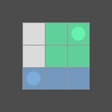
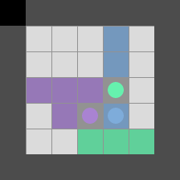
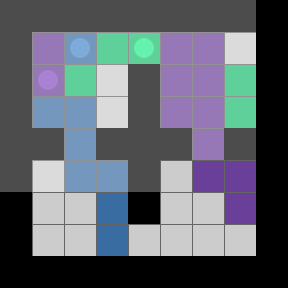

# Exploring the Impact of Markets on Multiagent Reinforcement Learning

A current research addresses the question of how to get mixed-motive agents to work together to achieve a common goal. Mixed-motive is an agent composition, that describes agents working independently and whose actions do not affect others directly. In most cases, the agents are not able to communicate. The influence to work in cooperation could be established through markets, namely a shareholder market (SM) or an action market (AM). By using markets, agents gain incentives when they act cooperatively. Shares of the SM let agents participate in the reward of others and an AM enables agents to reward others for certain actions.

This thesis introduces the coloring environment and uses it to compare the impact of the two markets in three different agent compositions - cooperation, mixed-motive and competitive. The coloring environment lets agents move around and color the cells they visit. Visiting a cell that is already colored removes its color, unless the competitive setting is set. In this case, the agent can capture opponent cells. The goal is to color the whole environment.

Furthermore, the compositions are established by means of reward distribution. Rewards of competitive and mixed-motive agents are calculated with their individual amount of color presence in the environment. Cooperative agents however, get one shared reward based on the overall coloration, which can lead to the credit assignment problem (CAP). Additionally, all three compositions face organizational challenges of agents getting in each other's way. The effectiveness of markets on these problems are analyzed in this research.

# Installation

First clone this repository and navigate into the project Folder

```
git clone https://github.com/zarahz/CMARL-CAP-and-Markets.git
cd CMARL-CAP-and-Markets/Coloring
pip install -e .
```

you can also try to install the requirements.txt

# Execution

Now you can run the project with the following algorithms

**Disclaimer**: When executing on windows some paths might need to be adapted, namely when normal slashes occur. Just replace those with two backslashes ( .../... -> ...\\\\... ).

## Training

### Training Parameters

To list all training parameters execute

```
> python -m scripts.train -h
```

### DQN Learning

For training with DQN in a small 5x5 grid you can execute

```
> python -m scripts.train --algo dqn --agents 2 --max_steps 10 --grid-size 5
```

the only required argument is `--algo`

### PPO Learning

For training with PPO in a small 5x5 grid you can execute

```
> python -m scripts.train --algo ppo --agents 2 --max_steps 10 --grid-size 5
```

again, the only required argument is `--algo`

## Visualization

The script called visualize enables the visualization of a trained model. The user can define how many episodes will be executed and observe how trained dqn or ppo agents behave. An example command is the following

```
> python -m scripts.visualize --algo ppo --agents 2 --max_steps 10 --grid-size 5 --episodes 10
```

To list all visualization parameters again just execute

```
> python -m scripts.visualize -h
```

## Examples of the Coloring Environment



2 mixed-motive DQN agents with a SM and the "goal" addition, can be recreated with the following command:

```
python -m scripts.train --algo dqn --agents 2 --setting mixed-motive \
--market sm-goal --max-steps 8
```



3 cooperative PPO agents and difference reward calculations, can be recreated with the following command:

```
python -m scripts.train --algo ppo --agents 3 --setting difference-reward \
--grid-size 7 --max-steps 20 --frames-per-proc 256 \
--frames 200000 --capture-interval 15
```



3 competitive DQN agents with a SM and the additions "goal-no-reset", can be recreated with the following command:

```
python -m scripts.train --algo dqn --agents 3 --model 3-dqn-competitive-sm-goal-no-reset \
--env FourRooms-Grid-v0 --setting mixed-motive-competitive --market sm-goal-no-reset \
--initial-target-update 1000 --target-update 10000 --replay-size 700000 \
--epsilon-decay 20000 --grid-size 9 --max-steps 30 --frames-per-proc 256 \
--frames 200000 --capture-interval 15
```

Further command examples can be found in the powershell files located in Coloring/scripts/powershell/.
To run all in sequence simply execute the run.ps1 script in a powershell terminal (can be found in Coloring/scripts/). Alternatively, the launch.json file located in the .vscode folder provide debug commands for visual studio code, ready to be executed.
